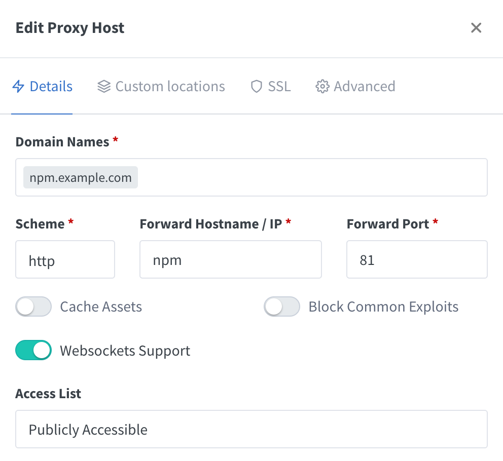

## Setup
1. Create a docker network
```bash
docker network create scoobydoo
```

2. Create a docker-compose.yml file
```yaml
services:
  npm:
    image: jc21/nginx-proxy-manager:latest
    restart: unless-stopped
    ports:
      - 80:80
      - 81:81
      - 443:443
    volumes:
      - ./data:/data
      - ./letsencrypt:/etc/letsencrypt
    healthcheck:
      test: ['CMD', '/bin/check-health']
      interval: 10s
      timeout: 3s

networks:
  default:
    external: true
    name: scoobydoo
```

3. Start the container
```bash
docker-compose up -d
```

4. Open the web interface
```ini
http://localhost:81
```

5. If you are using headless server, you can use SSH tunneling
```bash
ssh -L 8181:localhost:81 user@server
```
Then open the web interface
```ini
http://localhost:8181
```

6. Login with the default credentials and change the password
```ini
Email: admin@example.com
Password: changeme
```

## Set Reverse Proxy For NginxProxyManager
1. Go to **Hosts** -> **Proxy Hosts** -> **Add Proxy Host**

2. Fill in the form
```ini
Domain Names: npm.example.com
Scheme: http
Forward Hostname / IP: npm
Forward Port: 81
```


3. Remove the default port **`81`** from docker-compose.yml
```yaml
services:
  npm:
    image: jc21/nginx-proxy-manager:latest
    restart: unless-stopped
    ports:
      - 80:80
      - 443:443
    volumes:
      - ./data:/data
      - ./letsencrypt:/etc/letsencrypt
    healthcheck:
      test: ['CMD', '/bin/check-health']
      interval: 10s
      timeout: 3s

networks:
  default:
    external: true
    name: scoobydoo
```

4. Restart the container
```bash
docker-compose down && docker-compose up -d
```

5. Now if you go to **npm.example.com** you will see the NginxProxyManager web interface
